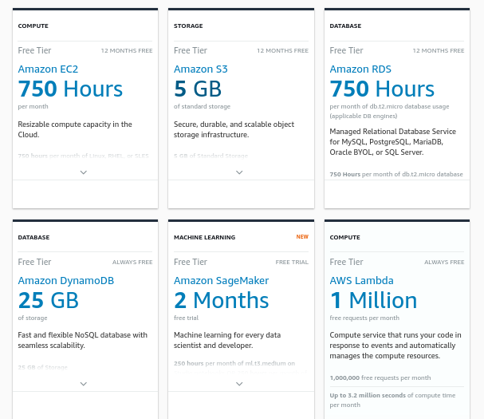

# Description, requirements

# Objective

**Main goal**: Predicting the results of future chess games ~~in the national championships~~ with respect to the played opening.

**Business needs / goals:**

As we are building a tool that will aid players in the preparation process against their opponents, it’s important to make the decision of the model interpretable - why certain openings yield better chances than others.

**Hypothesesis**: With the amount of data we have on chess players it's surprising no one has done predictive analytics on future results of games. I would like to tackle this exact problem using multi-stream data analysis. 
Another hypothesis I have is that comparing the opposing players' tendencies, strengths and weaknesses will help in the predicting process. 

**Hypothesis 2**: I believe that the chosen opening has a great impact on the outcome of the game, so I would like to test this as well. 

# Main idea

- Scrape [chess.hu](http://chess.hu) championship data
- Download championship games accordingly (also twic and games before twic (..-2012)
- Use other resources:
    - [chess.com](http://chess.com) games (find user ids by year of birth, first name and last name combinations etc. (use chess.com api)
    - [lichess.org](http://lichess.org) games (there is probably an api for it)
    - [fide.com](http://fide.com) statistics
    - facebook / linkedin / whatever data
        - where do they live (travel time)
        - field of work (might be hard)
        - social status(in relationship, single etc.)
        - university, education level
- (Calculated) player statistics :
    - **Opening** knowledge
    - **Calculation**
    - **Endgame Performance:** How accurately do you play in endgames? Can you grind out King and Pawn endgames to victory like you’re Magnus? Or are you losing in endings where you should have won? Usually > 10 pieces.
    - **Queenless middlegame** when queens are off and > 20 pieces
    - **Technical Skill:** How well one plays endgames with < 10 pieces.
    - endurance (how long until player loses a  worse position)
    - **Opportunism**: How often you take advantage of your opponent blunders. 100% means you punish them all, 0% means you counter-blunder them all.
    - **Luck**: How often your opponent fails to punish your blunders. 100% means they miss all your blunders, 0% means they spot them all.
    - Stats according to opponent rating
    - Queen trade (in some form)
    - **Advantage capitalization:** How often are you able to convert the advantages you gain into victories?
        - How big of an advantage do you need against certain ELO groups?  (e.g. can win +1 against +/- 100, but needs +3 against 2400+ opponents
    - **Resourcefulness:** How often are you able to recover when find yourself in losing positions.
        - How many of your worse positions do you lose? Is there an important margin?
    - **Mistakes & Blunders:** How often do you make mistakes/blunders compared to players in your rating range? And when are you most likely to make those mistakes?
    - Win rates by start time, opp rating, rating diff, color etc.
    - Avg game length
    - Time trouble probability
    - Opposite colored bishops results (strength/weakness).
    In positions where opposite colored bishops arise the stronger player has a huge score.
    - Pawn structure (using FEN/ECO code)
    - Stats from mega database → how openings mitigate/aggrevate skill difference
    - Use blitz games to guess opening knowledge, general tendencies (slow wins vs tactical outplays, where does he/she get an advantage? when does he/she play a bit weaker?)
    - Head-to-head?
- Game Statistics
    1. Average Centipawn Loss (ACPL)
    2. Percentage of 'Best' Moves
    3. Percentage of 'Mistake' or 'Blunder' Moves
- Opening statistics
    - How accurate both sides must be
    - Statistics of result regarding to elo difference
    - Statistics regarding how long the game goes and how it affects the result
    - average move for deviation  (how soon can you go out of book)
- Tendency to draw (from better or worse position, opponent rating, find a tendency)
- It could be somewhat similar to what spotify did with recommending similar songs
→ Find similar people

[Spotify's Discover Weekly explained - Breaking from your music bubble or, maybe not?](https://medium.com/the-sound-of-ai/spotifys-discover-weekly-explained-breaking-from-your-music-bubble-or-maybe-not-b506da144123)

> *"The underlying idea is that **people who listen to similar music likely have similar musical tastes**. Conversely, if the same group of like-minded people listens to two different songs, they’re probably similar."*
> 

# Papers, previous materials

### ***General tips for reading papers***

- read abstract + conclusion first
- scrim through the referenced works

### 

Chess programming wiki - Stockfish NNUE

[Stockfish NNUE](https://www.chessprogramming.org/Stockfish_NNUE)

## *Github repositories*

### Python-chess-annotator

[rpdelaney-archive/python-chess-annotator](https://github.com/rpdelaney-archive/python-chess-annotator)

```bash
Example usage: 
annotator -f 123.pgn -e -stockfish_21040618_x64_modern -g 1 -t 3 > out.pgn

usage: annotator [-h] --file FILE.pgn [--engine ENGINE] [--gametime MINUTES]
                 [--threads THREADS] [--verbose]

takes chess games in a PGN file and prints annotations to standard output

optional arguments:
  -h, --help            show this help message and exit
  --file FILE.pgn, -f FILE.pgn
                        input PGN file
  --engine ENGINE, -e ENGINE
                        analysis engine (default: stockfish)
  --gametime MINUTES, -g MINUTES
                        how long to spend on each game (default: 1)
  --threads THREADS, -t THREADS
                        threads for use by the engine (default: 1)
  --verbose, -v         increase verbosity
```

Annotation guide: 

[Numeric Annotation Glyphs - Wikipedia](https://en.wikipedia.org/wiki/Numeric_Annotation_Glyphs)

<aside>
💡 **Verdict: Looks good and fast !**
</aside>

Alternative: [https://github.com/fsmosca/chess-artist](https://github.com/fsmosca/chess-artist) 

Other resource: [https://github.com/programarivm/chess-data](https://github.com/programarivm/chess-data)

## Preparing against an opponent in real life

- most likely opening to happen
- young or old player
- at which part of the game does he win/lose? opening, middlegame, endgame
- list of mistakes of opponent
- strong suits of your opponent

# Overall plan for the whole project

1. scrape [chess.hu](http://chess.hu) (championship + ranklist data + games)
2. scrape [fide.com](http://fide.com) for monthly games played and elo movement
3. download theweekinchess.com games and games before that (now-2012: TWIC)
4. pair [chess.com](http://chess.com) and [lichess.org](http://lichess.org) accounts to players
5. create a database from the data above
6. create player profiles by analysing their games 

## Regarding scraping

1. Use Selenium for dynamic sites
2. Great Expectations for data quality check
    
    [Welcome to Great Expectations! - great_expectations documentation](https://docs.greatexpectations.io/en/latest/)
    
3. [Chess.com](http://chess.com) API 😇
    
    [Published-Data API](https://www.chess.com/news/view/published-data-api)
    

## Tools

1. If you have a valid school email, enroll in [AWS educate](https://aws.amazon.com/education/awseducate/) for some additional free credits.
S3 \$0.0245 per GB → 50GB ~1$
    
    
    
2. Sample notebooks, starter apps, and low/no code guides for rapidly (within 60-minutes) building and running open innovation experiments on AWS Cloud
    
    [aws-samples/cloud-experiments](https://github.com/aws-samples/cloud-experiments)
    
3. End to end Machine Learning with Amazon SageMaker Github repository
    
    [giuseppeporcelli/end-to-end-ml-sm](https://github.com/giuseppeporcelli/end-to-end-ml-sm)
    
4. Architecting a Machine Learning Pipeline (ML in the real world)
    
    [Architecting a Machine Learning Pipeline](https://towardsdatascience.com/architecting-a-machine-learning-pipeline-a847f094d1c7)
    
5. Metaflow is suggested for infrastructure (used by Netflix as well)
    
    [Welcome to Metaflow for Python](https://docs.metaflow.org/)
    
6. Analysing positions with Leela (and setup on GCP)
    
    [Google Cloud guide (lc0)](https://lczero.org/dev/wiki/google-cloud-guide-lc0/)
    
7. Introducing Amazon Managed Workflows for Apache Airflow → go for Prefect instead 
    
    [Introducing Amazon Managed Workflows for Apache Airflow (MWAA) | Amazon Web Services](https://aws.amazon.com/blogs/aws/introducing-amazon-managed-workflows-for-apache-airflow-mwaa/)
    
8. Technical diagrams
    
    [Log in](https://lucid.app/documents#/documents?folder_id=home)
    
    [A Free Database Designer for Developers and Analysts](dbdiagram.io)
    
    [Flowchart Maker & Online Diagram Software](https://draw.io/)
    

## On Data Collection

> “*The only way to learn about how biases will get encoded into a dataset is to make datasets and encode your own into them. More importantly, you need to **be very honest with yourself about what biases you’re likely injecting**. Who’s included/excluded from the data? What tech is used to collect the data and how does that mess with things? The list of things to consider and worry about is endless..”*
> 

### Data Sources

### Lichess

- **Lichess original API**
    
    [Lichess.org API reference](https://lichess.org/api)
    
    1. **Get cloud evaluation of a position.** ([https://lichess.org/api#operation/apiCloudEval](https://lichess.org/api#operation/apiCloudEval))
    Get the cached evaluation of a position, if available. Opening positions have more chances of being available. There are about 7 million positions in the database. Up to 5 variations may be available. Variants are supported.
    2. Tablebase lookup for 7 pieces
        
        [Lichess.org API reference](https://lichess.org/api#tag/Tablebase)
        
1. **7 piece endgame tablebase** (or use this: [https://github.com/niklasf/lila-tablebase](https://github.com/niklasf/lila-tablebase))

[Syzygy endgame tablebase probing - python-chess 1.6.1 documentation](https://python-chess.readthedocs.io/en/latest/syzygy.html)

- **Lichess Elite games database** (2400+ games)
    
    [Lichess Elite Database - Follow opening novelties in real time!](https://database.nikonoel.fr/)
    
- **ECO with FEN positions:**
[https://github.com/niklasf/chess-openings](https://github.com/niklasf/chess-openings)

# Step by step guide

1. Data Collection
    1. Write webscrapers to extract data from [chess.](http://chess.com)hu and [fide.com](http://fide.com) 
    2. Download twic weekly pgns to AWS S3, then parse them and store them in a database. (Twic is from 2012-)
    3. Find hungarian players on [lichess.org](http://lichess.org) and [chess.com](http://chess.com) 
2. Data Preprocessing
    1. Extract data with APIs from lichess.org and [chess.com](http://chess.com) for these players (also for elite games)
        1. personal stats (opening percentage etc.)
        2. games
    2. Extract UNIQUE FEN-positions from pgn's so that there is no duplicate work for analysis
    3. Go through fen's to see which positions are analysed on lichess and which are in 7-piece tablebase.
    Also match FEN positions for ECO codes.
3. Data Cleaning
4. Generate new features
5. EDA in way that can be showed (make it look nice)
    1. Redash vs Superset vs **Metabase**
6. Simple model
    1. Rule-based model
7. Complex model
    1. Dashboard for interpretation and comparison 

## How to install stockfish

1. download it from here: [https://stockfishchess.org/download/linux/](https://stockfishchess.org/download/linux/)
2. `unzip stockfish-*.zip`
3. `cd stockfish-*`
4. cd into the src subfolder 
    
    `make help`
    
    `make net`
    
    `make build ARCH=x86-64-modern`
    
5. `position fen <FEN_position>`

## Motivation

> “I am convinced, the way one plays chess always reflects the player’s personality. If something defines his character, then it will also define his way of playing.” - Vladimir Kramnik
> 

[The way to improve in chess](https://blog.aimchess.com/the-way-to-improve-in-chess-8f56eec3c37f)

COdes

```sql
CREATE TABLE twicgames (
	Event VARCHAR(100), 
	Site VARCHAR(100), 
	Date DATE, 
	Round VARCHAR(50), 
	White VARCHAR(100), 
	Black VARCHAR(100), 
	Result VARCHAR(10), 
	BlackElo INT, 
	BlackFideId INT, 
	BlackTitle VARCHAR(10), 
	Eco VARCHAR(50), 
	EventDate DATE, 
	Opening VARCHAR(100), 
	Variation VARCHAR(100), 
	WhiteElo INT, 
	WhiteFideId INT, 
	WhiteTitle VARCHAR(50), 
	moves VARCHAR(3000) 
);
```

docker ps: to list all docker images (running?)

docker inspect <container_id>: get info of the container (e.g. IP addr etc.)

```bash
docker run --name some-postgres -e POSTGRES_PASSWORD=mysecretpassword -d postgres
docker exec -it some-postgres bash
su postgres
psql
```

To restart it:

```bash
docker start twic-postgres
```

```sql
insert into anoop
select * from json_populate_recordset(null::anoop,
        '[{"id":67272,"name":"EE_Quick_Changes_J_UTP.xlsx"},
          {"id":67273,"name":"16167.txt"},
          {"id":67274,"name":"EE_12_09_2013_Bcum_Searchall.png"}]');
```

To run **Metabase in docker :**

```bash
docker run -d -p 3000:3000 \
-e "MB_DB_TYPE=postgres" \
-e "MB_DB_DBNAME=metabase" \
-e "MB_DB_PORT=5432" \
-e "MB_DB_USER=<username>" \
-e "MB_DB_PASS=<password>" \
-e "MB_DB_HOST=my-database-host" \
--name metabase metabase/metabase

docker run -d -p 3000:3000 \
-e "MB_DB_TYPE=postgres" \
-e "MB_DB_DBNAME=postgres" \
-e "MB_DB_PORT=5432" \
-e "MB_DB_USER=postgres" \
-e "MB_DB_PASS=mysecretpassword" \
-e "MB_DB_HOST=172.17.0.4" \
--name metabase metabase/metabase
```

How to change pw of postgres user in docker?  → `\password`