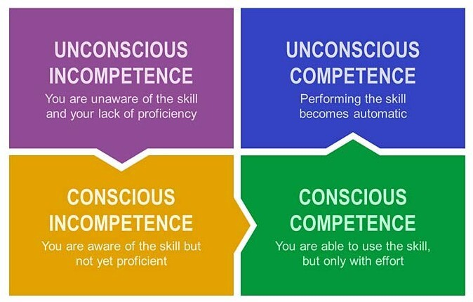
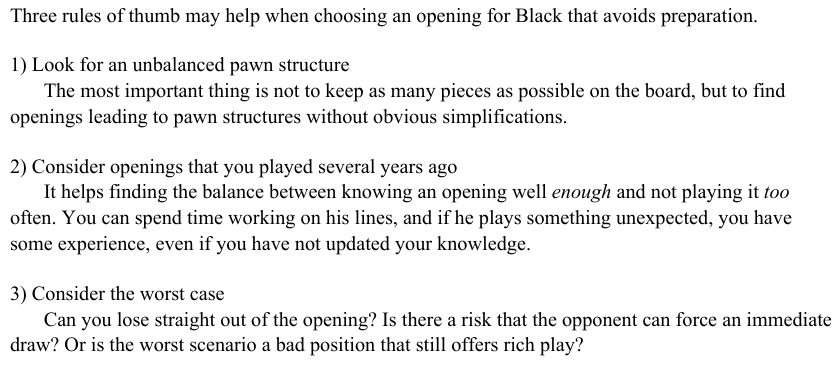
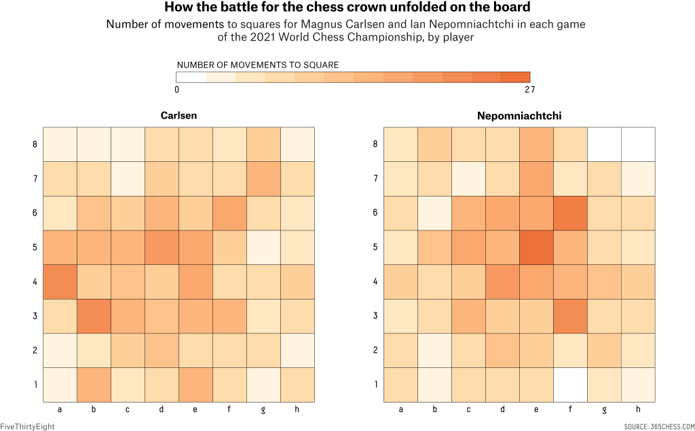
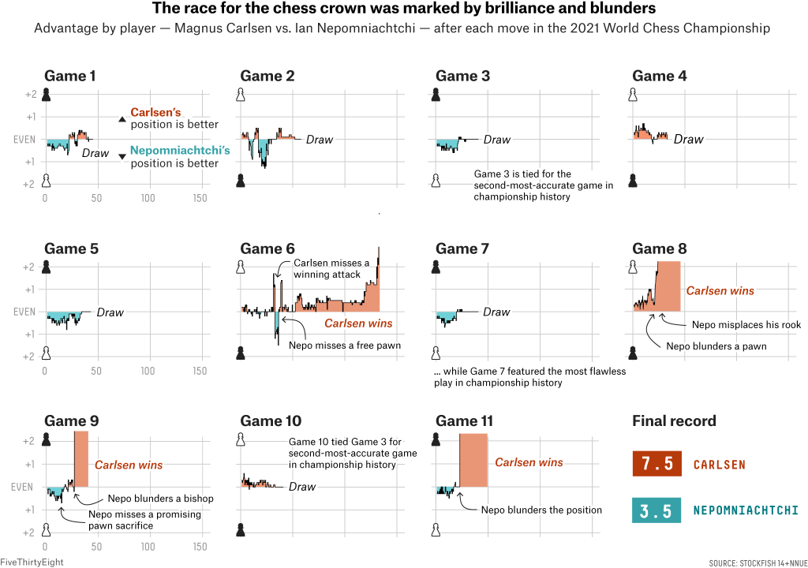

# Ideation

## Ideation

### Player statistics :

Add window for these features:

1. 3,6 months
2. 1 year
3. 2 year
4. 4 years
5. more

Features:

- **Opening** knowledge: Average cp at move 10,15,20
- **Calculation:** Average cp diff from move 20 to 40
- **Endgame Performance:** Average cp diff from 40 ? Margins ? Tablebase ?
    - How accurately do you play in endgames? Can you grind out King and Pawn endgames to victory like you’re Magnus? Or are you losing in endings where you should have won? Usually > 10 pieces.
    - **Technical Skill:** How well one plays endgames with < 10 pieces.
- **Queenless middlegame** when queens are off and > 20 pieces
- **Endurance:** how long until player loses a worse position
- **Opportunism**: How often you take advantage of your opponent blunders. 100% means you punish them all, 0% means you counter-blunder them all.
    - What’s your ‘punish-margin’?  P-value of 95% 🙂 )
- **Luck**: How often your opponent fails to punish your blunders. 100% means they miss all your blunders, 0% means they spot them all.
- **Stats according to opponent rating**
- **Queen trade** (in some form)
- **Advantage capitalization:** How often are you able to convert the advantages you gain into victories?
    - How big of an advantage do you need against certain ELO groups?  (e.g. can win +1 against +/- 100, but needs +3 against 2400+ opponents
- **Resourcefulness:** How often are you able to recover when find yourself in losing positions.
    - How many of your worse positions do you lose? Is there an important margin?
- **Mistakes & Blunders:** How often do you make mistakes/blunders compared to players in your rating range? And when are you most likely to make those mistakes?
- **Win rates** by start time, opp rating, rating diff, color etc.
- **Avg game length**
- **Time trouble probability →**Can we see a drop of performance between move 30-40 ?
- Opposite colored bishops results  (strength/weakness).
In positions where opposite colored bishops arise the stronger player has a huge score.
`This is hard to measure right now, delay this feature`
- **Pawn structure** (using FEN/ECO code)
- Use blitz games to guess opening knowledge, general tendencies (slow wins vs tactical outplays, where does he/she get an advantage? when does he/she play a bit weaker?)
`Delayed. We don’t track blitz games as of now.`
- **Head-to-head?**
- **Average Centipawn Loss (ACPL)**
- **Percentage of 'Best' Moves**
- **Percentage of 'Mistake' or 'Blunder' Moves**
- **Most critical phase** after the opening has been played
    - Hard to define, but generally **this is where advantages are generated**. Watch out for low level games, those might screw up this. Maybe we have to go range by range for this.
- **Percentage of results** (white, draw, black) in ranges (e.g. 1000-1600, 1600-2000, 2000-2200, 2200-2400, 2400-2500, 2500-2600, 2600-2700, 2700- ..)
- **Opening type** (e.g. open, semi-open, closed, flank)
- **Likely pawn structures to arise**
- **Average game length**
- **Opponent-level adjusted features do make sense**, but it's best if we create those features next to the unadjusted values and see which one the model likes more
- **Submetrics could be interesting** in the future, but probably it's **out of the scope** of the thesis
- **Number of unique openings played** (arised)
    - how can we define if someone is just exposed to many different new openings? -> compare it to avg
    - maybe it doesn’t matter if you choose to play lots of openings or your opponents are playing them: what matters is exposure
    - Could be useful: `see who deviates first!`
- **Trend**
    - winning streak
    - unbeaten streak
    - winless streak
- **Hotness / Form**
    - based on games from at most last week
    - useful to decide the player’s psychological state (did he lose a game when he was a big favorite?)
- **Stats for some timerange** - last x years / last y months
- **Consistency**
- **Opening deviation**
    - Who deviates usually first? Player1 or his opponents?
    - Deviation from what? Main-line theory, previous games of his, previous games of his opponent?
    - Watch out for transpositions: probably best if you keep only the important part of the FEN (no halfmove until 50 and fullmove)
- **Performance** for certain opening or timeframe

### Opening statistics

- **Required accuracy**: How accurate both sides must be
- **Statistics of result regarding to elo difference**
- Statistics regarding **how long the game goes** and **how it affects the result**
- **Average move for deviation**  (how soon can/will you go out of book)
- **Tendency to draw** (from better or worse position, opponent rating, find a tendency)
- It could be somewhat similar to what spotify did with recommending similar songs
→ Find similar people
- **Level of play with respect to the number of pieces** (e.g. plays well with lots of pawns on the board, needs bishops etc.)
- Assign **features corresponding to each opening on how useful** those are (e.g. London: positional 0.30, strategic: 0.1 etc.) → `isn’t this what actually our models should learn??`
    - we basically want to know which "features" make a player successful in playing the given opening
- **Opening leeway**:
One side is allowed to play 2nd, 3rd best moves while the evaluation doesn’t change much. In contrast, the opponent has to play near perfectly to maintain equality. 
*Similar to: stats from mega database → how openings mitigate/aggrevate skill difference*

### Finding Elo - Kaggle Competition

[Finding Elo](https://www.kaggle.com/competitions/finding-elo/discussion/13008)

[Top 26 Features, Most Important First](https://docs.google.com/spreadsheets/d/1g2d2rQrUUzqvtnA1xGe9JGLHnQZe7YERxbaLUb9dB1g/edit#gid=0)

Winning solution:

[Notebook on nbviewer](https://nbviewer.org/github/elyase/kaggle-elo/blob/master/main.ipynb)

[Notebook on nbviewer](https://nbviewer.org/github/elyase/kaggle-elo/blob/master/features.ipynb)

[Notebook on nbviewer](https://nbviewer.org/github/elyase/kaggle-elo/blob/master/Model%20Training.ipynb)

### Complexity of a chess position

Tells you how sharp a chess position is.

[https://github.com/cgoldammer/chess-complexity-frontend](https://github.com/cgoldammer/chess-complexity-frontend)

## FEN analysis

- Number of pieces from pawns to rooks
- Are both queens off the board?
- Pawn structure

### Analyzing Blitz Chess Games: Why? And How to Do it! (source: [https://chessmood.com/blog/analyze-blitz-chess-games](https://chessmood.com/blog/analyze-blitz-chess-games)) Article by GM Avetik Grigoryan

- Hypothesis: some ingrained mistakes can be identified
- Ingrained mistake examples:
    - Exchanging pieces results in better/worse positions?
    - Unconscious competence– i.e. when you understand things without needing to think about them.
        
        
        
    
    > *“There are many things you’ve learned, but you don’t understand them deeply enough yet. You will make these mistakes when your mind isn’t fresh.. by analyzing your hands when you’re tilting, I’ll be able to see which concepts you understand deeply and which ones you don’t.”*
    > 
    - *"**The thing is that with blitz games, it's easier to notice their style, strengths, and weaknesses.** Why? Because they do many things unconsciously and their moves are played purely on instinct."*
    - *"In a standard game, they [chess players] would have time to think about it and try to make the optimal decision. But during blitz, most of the time they’ll try to go into their comfort zone."*
    - *"It becomes **easy to notice their unconscious competence** – in which kind of positions they blunder, how good their endgame understanding is, and many other skills."*
    - *"..  what’s interesting is that everyone’s blunders are very individual. Some players blunder lots of forks, some blunder lots of backward moves, and some blunder moves along diagonals."*

### Discussions with pro chess players

1. Takeaways from the discussion with GM Ruck Róbert (aka Rucki)
    1. blitz games have 0 importance according to him
    2. maybe people play out their openings in rapid games, but probably not in blitz
    3. people make mistakes in similar conditions
        - maybe it's connected to pawn structure (open/closed)
        - maybe he doesn't like to the dynamic of the position (doesn't like to attack, positional play is boring for him) `- Stockfish analysis could be useful to track this`
        he used the term "suffer" for this
    4. does he/she like to draw? 
        - does the rating of the opponent impact this?
        - does the size of the advantage matter? at what point does he/she refuse to accept the draw?
        Note: It's hard to identify when someone rejects a draw offer, we can only base our assumptions on when he accepts them. Maybe find a tendency in this? Potential reasons might be: 
        - Positions starts to slip out of control
        - Sudden threat(s)
        - After exchange
        - Material advantage after last move
        - maybe draw offer outcomes are predictable based on elo rating +/- and eval? player bias (e.g. doesn't like to draw in position with space advantage)? `- Stockfish analysis could be useful to track this`
    5. the better rated a player is, the less weaknesses he/she has in his play (duh)
    6. a smart opening choice can have a great impact on the result of the game 

### Insights from The Secret Ingredient by *Jan Markos, David Navara* (2021, QualityChess)

This is what I usually do:

1. First, **I look into their statistical data**. 
    - How many games have they played recently?
    - Against whom? - AVG, MAX, MIN
    - At what tournaments? - Tournaments itself doesn’t matter, but some aspects of it do
        - AVG player strength
        - Length of tournament
        - Type of tournament
        - Number of players
        - How international the tournament is
    - How old are they?
    - How has their rating evolved in the last few years?
        - Easily calculated, just take a loot at the player’s elo from the previous month
    - What does all this data tell me about the player?
2. Then **I replay their recent games and notice their best and worst performance.** 
    1. What does their best game look like? 
    2. Can we draw any conclusions on their playing style from observing these games?
3. When replaying their games, I **pay attention to any peculiarities or deviations from the norm.** 
    1. Do they have a favourite move, manoeuvre or set-up? 
    2. Do their games reveal any gap in their chess knowledge?
4. Finally, I **review the games they played against an opponent of my strength**. 
    1. Do they often face grandmasters? 
    2. How do they behave if they do? 
    3. Do they enter an open fight or rather play for a draw?

### Insights from *Street Smart Chess* by Axel Smith (2021, QualityChess)

1. *“Nowadays it’s much more about trying to guess what your opponent hasn’t looked at before the game, rather than the quality of analysis,” said Anish Giri to Chess24. .. it’s **more about the direction you choose, where you can outsmart them.**”*
    
    
    The main competitive advantage is maybe that it’s possible to choose the openings based on the opponent. There are many clever choices:
    
    - A positional opening against a tactical player
    - A tactical opening against a positional player
    - A forcing opening against a stronger player, leaving less play/material afterwards
        - `How can we identify “forcing openings”?` High price for incorrect moves?
    - A calm opening against a weaker player
    - A cutting-edge opening against an outdated player
    - A system against an opening expert
    - An opening keeping many pieces against someone who appreciates the endgame
2. .. sidestep the opponent’s preparation in order to obtain as much play as possible after the opening phase has ended. It’s an effective idea **against opponents who have good openings**, but also in general when **they are weaker**.
3. .. as much theory as possible, leaving fewer decisions to the human player. This is a strategy that works well when a draw is an acceptable result.
4. 3 rules of thumb for choosing an opening as Black that avoids preparation
    
    
    
5. **Fressinet puts surprise first.** There is no global concept of how to play the opening **against a lower-rated player**; his only rule is to **make the opponent think on his own as early as possible**.
6. "**The goal when playing White changed to getting playable positions**, focusing on tricky move orders. Turning on the engine was something everyone could do, but **understanding small nuances is a different story.**" Kramnik is an example for this, who used to play sharp openings but then moved to the London and 1.e4 sidelines, and when he ran out of ideas he quit. 
7. PHN argues that nowadays everyone has access to strong engines and opening books, but not everyone can understand the **move-order nuances**. Therefore he recommends that we skip spending tons of time on deep analysis and instead focus on understanding move orders.

### Random bits on practical choices

> *“.. when you play a kid who is 2200 you are supposed to get them into an endgame, because they don’t know endgames.” - Hikaru Nakamura ([source](https://www.youtube.com/watch?v=At12JheWWOU&ab_channel=GMHikaru))*
> 

### Usage of Stockfish NNUE

1.  Static eval usage
    1. At which aspect does one generate advantage (e.g. material, space etc.) ? What about disadvantage?
    2. If in advantage, to which other aspect does he convert it to? (e.g. Threats → Material)
    3. Which advantage can he/she convert well? Which does he NOT convert well?
    4. What are his best pieces (bishops, knights)? 
2. NNUE Derived Piece Eval
    1. Best / Worst pieces over a game: What pieces cause him to lose/are in a bad position? Aggregate these ! 
    2. Which pieces improve or worsen usually? (Happy pieces concept)
3. NNUE Network contribution
    1. Classical eval
    2. NNUE eval
    3. Final eval
    4. Buckets

**Do we want to look at NPS or depth?** 

[The Ultimate Chess Training Platform](https://chessify.me/blog/nps-vs-time-to-depth-what-you-should-look-at-when-analyzing-with-stockfish/)

### Selecting games

1. Main question: what games do we select for analysis?
2. Give higher weights to more recent games?
3. How do we consider circumstances?
    1. Maybe a draw was enough
    2. Maybe we can use the tournament type to guess     

### Find a metrics that characterises the best player

1. Can we find a metric that describes the difference between players? 
    1. is it about accuracy
    2. is it about making the least number of “big” mistakes

### Heatmap of used squares

How to use this?

1. General map of a players’ moves (which squares does he like, maybe even by piece)
2. Map of used squares from the best players of a certain opening
    1. Which squares do they use the most
    2. Where do they put their pieces

### Plot of ‘timeline’ for the last couple of games (what’s the average arch of the players’ games?)

Source:

### Rate openings similar to how LS rated LoL champs (idea taken from Magic)

LS used the idea of assigning colors to LoL champions based on their identity and aggressiveness

1. Black
2. Red
3. Blue
4. Green
5. White

### LS at Hotline League saying familiary matters a lot when opponents of uneven skill play against each other

At one Hotline League episode, LS said that in order for the west to beat eastern teams they should guide the game towards familiar territory for them, and unfamiliar for the ‘favourite’, thus trying to have some unbalance in terms of not pure skills, but familiarity (from 25.00) - Also metagaming in card games 

14 out of 16 card game players play the same deck, 2 will try to target these ‘meta’ decks to surprise them 

*Note: Caedrel also talked about this on his stream, saying that the only way LEC (worse teams) can beat LCK,LPL (better teams) is if they have something nieche that they are more familiar with. On even grounds it’s really unlikely to happen.*

[https://www.youtube.com/watch?v=J9DamwPhqhE&t=43s&ab_channel=TravisGafford](https://www.youtube.com/watch?v=J9DamwPhqhE&t=43s&ab_channel=TravisGafford)

### What imbalances is your opponent the best at?

E.g. rook + bishop vs rook + knight

### Computers giving rating on how different a move is to find for a human

Source: 

[Do any chess computers give a rating on how difficult human would find to play them?](https://www.reddit.com/r/ComputerChess/comments/sll66t/do_any_chess_computers_give_a_rating_on_how/)

Can we use this to go for positions where our opponent is more likely to go astray? Can we do something like this for each person (based on positon, move type etc.) ?

## Extras

### Based on TWIC

- Weekly / monthly opening recommender (best games, best novelties, trending lines etc.)
- Report from the past 1-2-3-4-8-12 weeks that shows:
    - the most trending openings
    - openings that suddenly perform a lot better (maybe due to a novelty or a new idea)
    - your openings (that you have selected previously) and their win percentage
- Report from the most important openings played last week
- Best model player of the opening

## Pawn Structures:

## Questions

- Why do upsets happen? What's in common between them? Did the weaker player manage to have a great game? Did the strong player blunder? Did the strong player overforce the issue in an equal position?
- Is there an adequate comparison in chess for the set-pieces of soccer? In soccer weaker teams might cause a lot of problem with set-pieces. Maybe openings or systems? Maybe tricks (I doubt it)?
- In soccer weaker teams caused trouble with playing unconventionally (e.g. Touchel's dynamic formations). Is there something similar in chess? Maybe when a weaker player directs the game into unfamiliar territory is similar!?
- What's the XG of chess? Evaluation + dynamic between two players + state of the game? Evaluation + Remaining material?
- How do you measure advantage-increasement speed? CPL per move? CPL per 5 move? Best players at converting advantages? What's their secret? 
Players who bleed out their opponents?
- How well does a player punish bad and slightly worse openings?
- Which openings are most popular in OTB chess? (use TWIC database)
- If the last move was a piece exchange, did it improve the position?

### Carlsen vs Nepo 2021 Championship Post match comments

Some snippets from the interview with Nepo after the WCC 2021 between Carlsen and Nepo

**To what extent did everything go according to your plan?**

> “*We managed to surprise Ian. [...]* *That’s already not bad, as World Championship matches go. And we also believed that Magnus simply plays chess better — our preparation was also based on that. If we can get a complex position that’s unfamiliar to both players, that’s an acceptable result. If Magnus knows it a little better, that’s even better.”*
> 

**Did Carlsen deliberately extend the games in order to unbalance Ian?**

> “*We didn’t discuss it, but I think that was one of the elements. Magnus is more resilient, and then there was also the schedule. Previously there was usually a rest day after two games, but here there were three in a row.”*
>