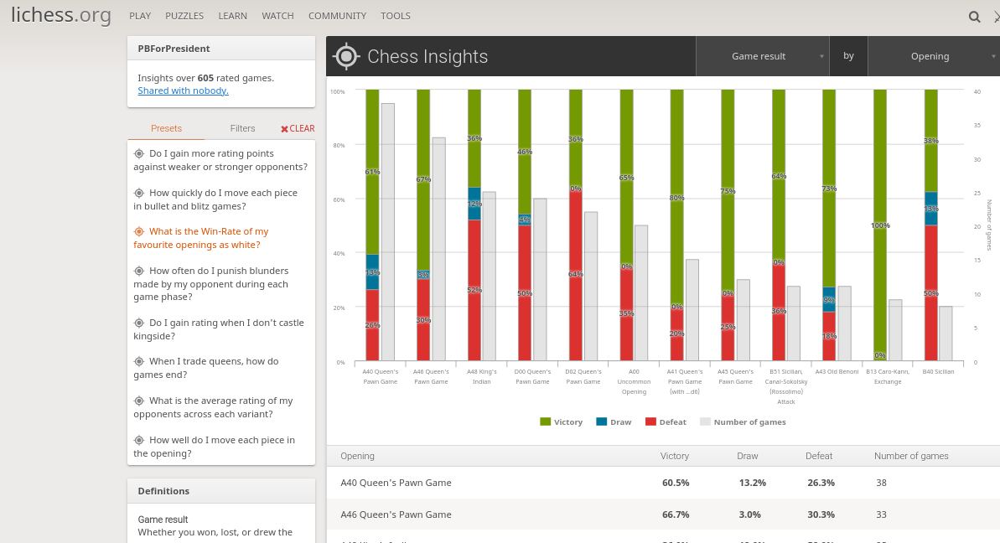
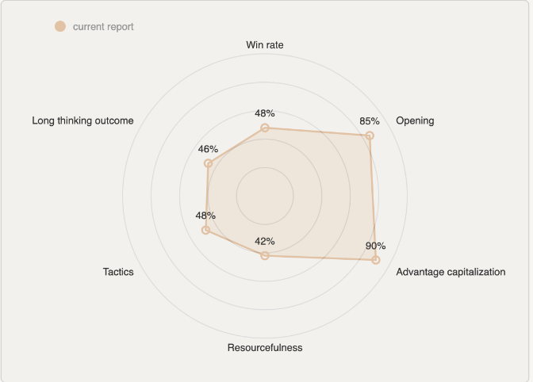
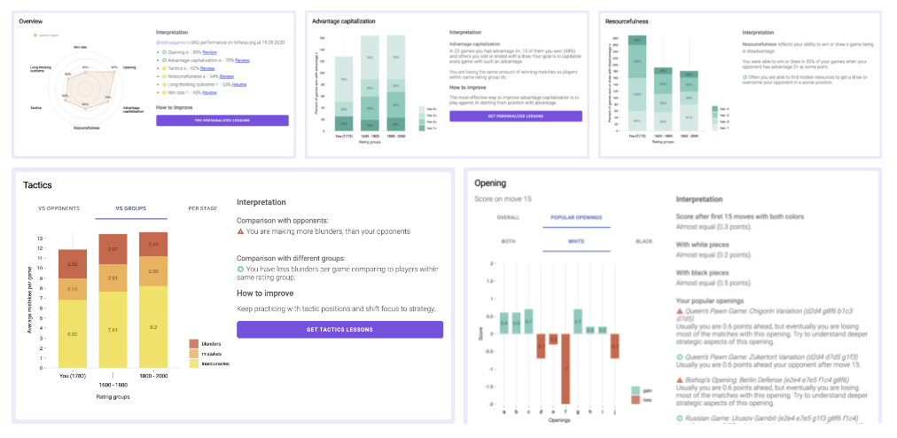

# Research (Blogs, articles)

# ***Papers***

## Topic: Chess

### Chess Game Result Prediction System (2013, CS229 ML Project Report)

[Source](http://cs229.stanford.edu/proj2013/FanKuangLin-ChessGameResultPredictionSystem.pdf)

Conclusion: 

- They developed a new chess rating system.
- Trained on the games of 2000 players (no info on how many total games that is). Reached accuracy of 55.64%
- They split the dataset to two part based on time (135 month period)

### Computer Analysis of World Chess Championships (2006)

Conclusion:

- They looked at
    - Avg diff between moves played and best evaluated moves (loss per move)
    - Blunder-rate
    - Average positions complexity
    - Expected number of best moves played
    - Tendency to exchange pieces

### Perception in Chess (1973)

*Conclusion: By confronting chess players of varying strength, from master to novice, with a perception task and a memory task, we have shown that the amount of information extracted from a briefly exposed position varies with playing strength, thus confirming earlier experiments of de Groot, Jongman, and others. (however the same is not true for random positions)*

### Chess and Mathematics Performance of College Players: An Exploratory Analysis

### Improving International-Level Chess Players’ Performance with an Acceptance-Based Protocol: Preliminary Findings

### Doping for Chess Performance

### A complete database of international chess players and chess performance ratings for varied longitudinal studies

- Chess is a great domain because the ease of identification of experts and their development
- Chess has been particularly useful for the study of expertise. Researchers have examined the development and possible decline of high performers, with findings often generalizing to many other domains.
- `Charness, Krampe, and Mayr (1996) studied the effects on chess performance of age, coaching (which apparently had little effect), and amount of practice.`
- ..the `peak chess performance age is about 35 years old`; performance may decline thereafter because `overall chess skill is a race between a player’s decreasing fluid intelligence after age 20 and increasing domain-specific knowledge with experience`.
- Chess players' performance beyond 64 squares: A case study on the limitations of cognitive abilities transfer
- Expert performance of men and women: A cross-cultural study in the chess domain
- [Role of deliberate practice in chess expertise](https://clinica.ispa.pt/ficheiros/areas_utilizador/user11/11_-_the_role_of_dp_in_chess_expertise.pdf)
    
    > *"... deliberate practice plays a critical role in the acquisition of chess expertise, and may be useful in addressing pedagogical issues concerning the optimal allocation of time to different chess learning activities."*
    
    Charnes et al (1996): *"... subsequent regression analyses revealed that **cumulative serious solitary chess study** was the single most powerful predictor of chess skill ratings among a broad set of potential predictors, **including tournament play and coaching**"
    
    "In some analyses, particularly **for younger players, cumulative hours of play in tournaments** also served as an independent predictor of current skill level. Years of
    **individual chess lessons** also played a significant role ..."
    "... players ought to devote the majority of their time to that activity [individual study]. However, **for a younger player, tournament play does make an independent contribution** to current skill level."*
    > 

## Topic: CRISP-DM

### CRISP-DM: Towards a Standard Process Model for Data Mining

*The generic CRISP-DM process model is useful for planning, communication within and outside the project team, and documentation. The generic check-lists are helpful even for experienced people.*

### A Systematic Literature Review on Applying CRISP-DM Process Model (2021)

[A Systematic Literature Review on Applying CRISP-DM Process Model](https://reader.elsevier.com/reader/sd/pii/S1877050921002416?token=54647F1340C4FB32551AB5ADAC059BE8B2F2858FC5BBE0006DA53B6BDD1C8310ED3E37C296608208071B5B1A10307A26&originRegion=eu-west-1&originCreation=20220504122232)

### A machine learning framework for sport result prediction

Mix between CRISP-DM and general sports analytics. `Must read!`

Conclusion:

- 

## Topic: Sports Analytics

# Books

### Football Hackers

[Football Hackers: The Science and Art of a Data Revolution](https://www.amazon.co.uk/Football-Hackers-Science-Data-Revolution/dp/1788702050)

### Top 5 list on medium

[5 Sports Analytics Books to Get You Started](https://medium.com/playing-numbers/5-sports-analytics-books-to-get-you-started-d532471563eb)

### Another list

[Sports Analytics Reading List](https://brendankent.com/2021/06/15/sports-analytics-reading-list/)

### The Secret Ingredient (Chess)

[The Secret Ingredient](https://www.amazon.com/Secret-Ingredient-Jan-Markos/dp/1784831433)

### Street Smart Chess by Axel Smith (2021) - award winning author

[Street Smart Chess by Axel Smith](https://www.qualitychess.co.uk/products/2/393/street_smart_chess_by_axel_smith/)

# Blogs, articles

- Lichess Chess Insight
    
    
    
- Aimchess:

- Vladimir Tukmakov - Modern Chess Preparation (2012)
- [Data Analysis of a players games on chess.com](https://medium.com/swlh/data-science-project-looking-for-hidden-insights-in-my-2-thousand-chess-games-27cfc06b6e94)
- [How To Analyse Chess Games Using Graph Networks](https://medium.com/applied-data-science/how-to-analyse-chess-games-using-graph-networks-38dd3b77d4be)

###  [CRISP-DM módszertan - Mi az és hogyan használd? - Dmlab](https://dmlab.hu/blog/crisp-dm-modszertan-mi-az-es-hogyan-hasznald/)

## How AI improved other sports

- **Cricket**: AI is used in Cricket to improve the strategy of the game.
- **Baseball**:
    - One of the key areas where AI has managed to make a difference in the sport includes scouting new players.
- **Football**: Furthermore, Olocip, a Madrid-based company uses machine learning algorithms to predict the success or failure on the field for the next 15 minutes as the game is being played.
- **Tennis**: IBM Watson has been taught to recognize the best moments in a match. It does it all: from listening to the noise of the crowd and sensing their reactions to noticing the body language of the audience.
- **Basketball**:
    - Consider the example of HomeCourt; a computer vision and AI-based app that can help the players improve basketball shooting.
    - Ghosting (search for Toronto Raptors)

### [Aimchess Recap 2021](https://aimchess.com/recap/li/PBForPresident/2021)

### [Chess.com article on understanding FEN strings](https://www.chess.com/terms/fen-chess#how-does-fen-work)

### If you want to write a summary about this project, take a look at this article from Gojek. It’s really well organised and goes through most of the important points

[How We Estimate Food Debarkation Time With 'Tensoba'](https://medium.com/gojekengineering/how-we-estimate-food-debarkation-time-with-tensoba-da05674cb758)

### A person analysing his own games

[Performance by Game Phase](https://natesolon.github.io/blog/endgame)

[Analyzing Chess Positions in Python - Building a Chess Analysis App (Part 1)](https://blog.propelauth.com/chess-analysis-in-python/)

### Google’s Rules of ML

[Rules of Machine Learning: | ML Universal Guides | Google Developers](https://developers.google.com/machine-learning/guides/rules-of-ml)

### Aronian in an [article](https://www.chess.com/news/view/alphazero-reactions-from-top-gms-stockfish-author):

> *"Currently I am analyzing with a program that is five years old! So I don't care so much, **it's more about adopting the programs to suit your playing style** rather than have the best computer program. At the end of the day the position you get, you're going to play, not the computer so it has to suit human's taste."*
> 

### MOBALYTICS Q&A Takeaways on GPI

[Dev Blog Q&A: Challenges and GPI - Mobalytics](https://mobalytics.gg/blog/dev-blog-qa-challenges-gpi/)

- some roles require different scores, as the emphasis of that role is different
- players need baseline scores to be effective, after that the returns are diminishing (e.g. improving farming form 80 to 90 is a lot less important than improving awareness from 20 to 30)
- they made the metrics so that it accounts for opponent level: for example only people in CHallanger can receive the best scores, other tiers / divisions were maxed out for a specific value (e.g. Bronze players can only get 20/100 for positioning)

### Other mobalytics features

- they advise players to compare their GPI scores with players from their rank as it would show potential improvement areas
- most (big) GPI metrics are made up of smaller ones, aka submetrics

### Based on Mobalytics some new ideas...

- assign **features corresponding to each opening on how useful** those are (e.g. London: positional 0.30, strategic: 0.1 etc.) → `isn’t this what actually our models should learn?`
    - we basically want to know which "features" make a player successful in playing the given opening
- **opponent-level adjusted features do make sense**, but it's best if we create those features next to the unadjusted values and see which one the model likes more
- **submetrics could be interesting** in the future, but probably it's **out of the scope** of the thesis

### Blog post on Multiclass Classification Metrics

[Comprehensive Guide on Multiclass Classification Metrics](https://towardsdatascience.com/comprehensive-guide-on-multiclass-classification-metrics-af94cfb83fbd)

### XGBoost Hyperparameter Optimization

[XGBoost Parameters | XGBoost Parameter Tuning](https://www.analyticsvidhya.com/blog/2016/03/complete-guide-parameter-tuning-xgboost-with-codes-python/)

[Notes on Parameter Tuning - xgboost 1.6.1 documentation](https://xgboost.readthedocs.io/en/stable/tutorials/param_tuning.html)

### XGBoost Feature Importance

[Python API Reference - xgboost 1.6.1 documentation](https://xgboost.readthedocs.io/en/latest/python/python_api.html#xgboost.Booster.get_score)

[Be careful when interpreting your features importance in XGBoost!](https://towardsdatascience.com/be-careful-when-interpreting-your-features-importance-in-xgboost-6e16132588e7)

### Explain multiclass XGBoost with SHAP

[Explaining Multi-class XGBoost Models with SHAP](https://evgenypogorelov.com/multiclass-xgb-shap.html)

### XGBoost explained (how the algorithm works)

[Introduction to Boosted Trees - xgboost 1.6.1 documentation](https://xgboost.readthedocs.io/en/stable/tutorials/model.html)

### FS + Hyperparam opt library for XGBoost

[https://github.com/cerlymarco/shap-hypetune](https://github.com/cerlymarco/shap-hypetune)